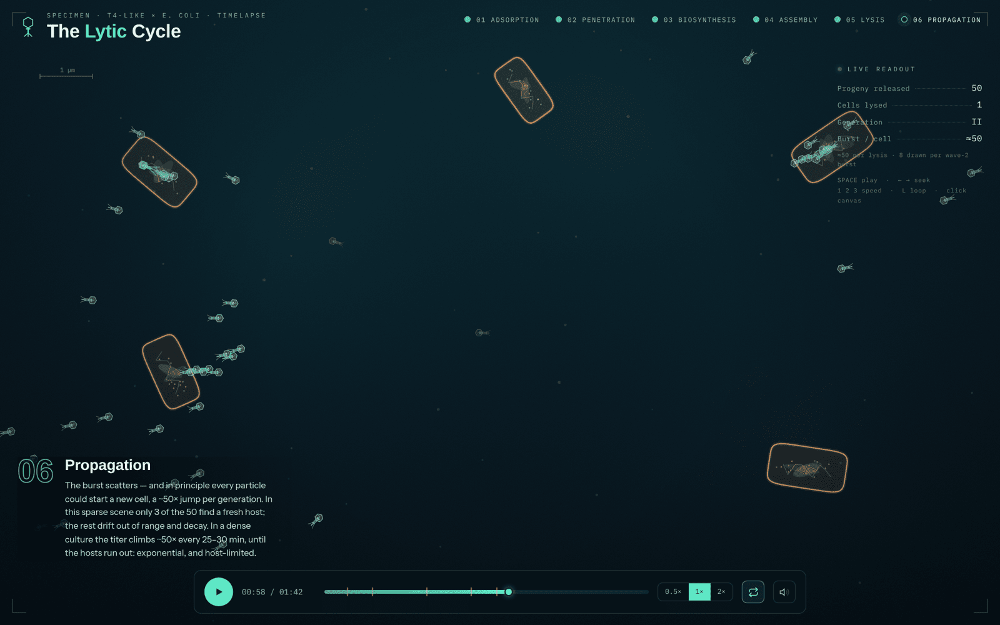
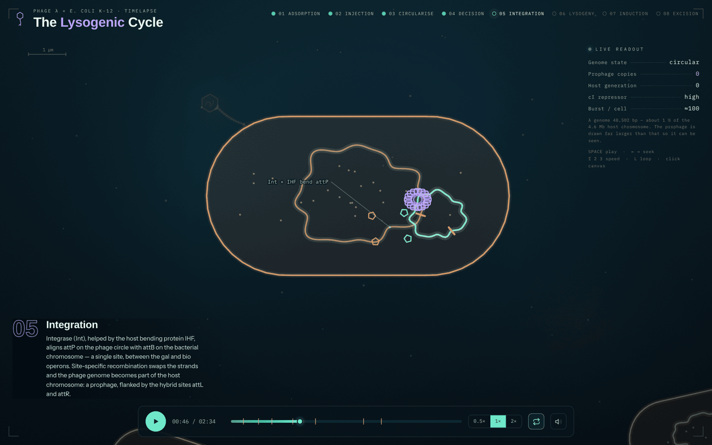

# Bacteriophage life cycles

Two animated timelapses of bacteriophage infection, drawn to canvas as
self-contained HTML files. No build step, no dependencies, no framework — open
a file and it runs. Written for teaching.

### **[▶ Watch them here](https://seannair.github.io/Bacteriophage-life-cycle-animation/)**

| | | |
|---|---|---|
| **[The Lytic Cycle](https://seannair.github.io/Bacteriophage-life-cycle-animation/phage%20lytic%20cycle.html)** | a T4-like phage × *E. coli* | 6 phases · 1:42 |
| **[The Lysogenic Cycle](https://seannair.github.io/Bacteriophage-life-cycle-animation/phage%20lysogenic%20cycle.html)** | phage λ × *E. coli* K-12 | 8 phases · 2:34 |

## The lytic cycle

Infect, take over, burst — then do it again in the neighbouring cells.

| # | Phase | Starts | What happens on screen |
|---|-------|--------|------------------------|
| 01 | Adsorption | 0:00 | Tail fibers probe the surface; two lock onto outer-membrane receptors |
| 02 | Penetration | 0:07 | The sheath contracts, the tail tube punches through, the genome streams in |
| 03 | Biosynthesis | 0:15 | Host DNA is shredded; phage DNA, capsids and tails are mass-produced |
| 04 | Assembly | 0:32 | Heads pack DNA, tails and baseplates snap on — ~50 particles per cell |
| 05 | Lysis | 0:46 | Lysins digest the wall; the cell swells and ruptures |
| 06 | Propagation | 0:54 | The burst scatters, three progeny find fresh hosts, generation III bursts |

## The lysogenic cycle

Integrate and wait. λ is the canonical lysogen, and the film names the actual
molecules at every step rather than saying "the phage DNA joins the bacterial
chromosome" and moving on.

| # | Phase | Starts | Molecules named |
|---|-------|--------|-----------------|
| 01 | Adsorption | 0:00 | tail-tip protein J → LamB maltose porin |
| 02 | Injection | 0:08 | non-contractile Siphoviridae tail; 48,502 bp linear dsDNA |
| 03 | Circularisation | 0:18 | 12-nt cohesive cos ends; host DNA ligase |
| 04 | The Decision | 0:27 | CII vs host proteases; cI dimers vs Cro at Oᴿ |
| 05 | Integration | 0:41 | Int + IHF; attP × attB between *gal* and *bio* → attL/attR |
| 06 | Lysogeny | 0:56 | vertical inheritance; superinfection immunity; lysogenic conversion |
| 07 | Induction | 1:28 | UV → SOS → RecA\* co-protease → cI self-cleavage |
| 08 | Excision & Lysis | 1:40 | Xis + Int; rolling-circle concatemer; cos packaging |

Both films hold the end card for 30 seconds before looping.

## Controls

| Key | Action |
|-----|--------|
| `Space` or click the canvas | Play / pause |
| `←` `→` | Seek ±4 seconds |
| `1` `2` `3` | Speed — 0.5×, 1×, 2× |
| `L` | Toggle looping |

The phase names along the top are clickable and jump to that phase. The
scrubber marks phase boundaries with amber ticks and previews the phase under
the cursor. Sound is off by default — the speaker icon enables a procedural
soundtrack built with the Web Audio API, so there are no audio files to load.

## Where the animations simplify

Every teaching animation lies somewhere. These are the places these two do, so
that the exaggerations are not mistaken for scale:

- A wild-type T4 burst is 100–200 particles; the lytic film uses ≈50, a
  conservative figure for T4-like phages in poor conditions. λ uses ≈100.
- All 50 progeny are drawn at lysis, but only 3 find a host, because the scene
  is deliberately sparse. In a dense culture nearly every particle that adsorbs
  starts a new burst — hence roughly 50× per 25–30 minute generation, until the
  hosts run out.
- Generation III draws 8 particles per bursting cell rather than 50, for
  legibility. The telemetry panel reports the biological figure, not the drawn one.
- The λ prophage is drawn as roughly 18 % of the host chromosome. It is really
  about 1 % — 48.5 kb inside 4.6 Mb. The readout panel says so on screen.
- Only 2 of the 4 lysogens induce after UV. Induction is never 100 % efficient,
  and leaving two lysogens standing makes that visible.
- Time is compressed and uneven between phases: the eclipse period is given far
  less screen time than its share of a real 25-minute infection, because very
  little changes to look at during it.

Cholera toxin is deliberately *not* offered as an example of lysogenic
conversion in the λ film. It is prophage-encoded, but CTXφ is a filamentous
phage that extrudes from the cell rather than lysing it, so it does not follow
the life cycle being shown. Shiga toxin, carried by genuinely lambdoid
prophages, does.

## Running them

Open either file in any modern browser, including straight from the filesystem
(`file://`). The only network request is a Google Fonts stylesheet, and both
degrade to system fonts without it. Nothing is tracked and nothing is loaded
from anywhere else.

Rendering is a single `<canvas>` driven by `render(t)`, a pure function of
elapsed time — every particle position is derived from `t` rather than
accumulated frame to frame. Scrubbing, seeking and speed changes are therefore
exact, and an animation cannot drift out of sync with its own timeline. The
lysogenic film adds a camera (`cam(t)`) that pushes in on the single infected
cell while the molecular action happens inside it, pulls back over the first
division to reveal the microcolony, and pushes in again for induction.

Tested in Chrome, Firefox and Safari. Both respect `prefers-reduced-motion` by
starting paused.

## Editing the timelines

Times are in seconds of animation time and live in a few named places near the
top of each script:

| Constant | What it controls |
|---|---|
| `B` | the phase boundaries |
| `PH` | phase names and caption text |
| `ANN` | pointer labels — in time `a`, out time `b`, an anchor and a text offset |
| `SCN` / `HOLD` | length of the animated scene, and of the end-card hold |
| `SFX_GAIN` | overall soundtrack loudness, with a limiter after it |

Lytic only: `G2T` — arrival, injection and lysis times for the three
second-generation cells.

Lysogenic only: `INT0`/`INT1` and `EXC0`/`EXC1` for the integration and excision
windows; `DUP1`/`SEP1`/`SPR1` and their `2` equivalents for chromosome
duplication, septum closure and daughter separation at each division; `UV0`/`UV1`
for the UV exposure; `IND` for which cells induce and `LYS` for when they lyse;
`cam()` for the camera moves.

Both films draw the bacterium as a stadium — a rod with hemispherical poles —
via `capPt` / `radOf`, so changing a cell's `hw` and `hh` keeps a correct
outline and a correct surface for phages to dock against.

## Licence

Dual licensed, because these files hold two different kinds of work.

| | | |
|---|---|---|
| **Code** | [MIT](LICENSE-MIT) | The engine, timeline, camera, audio and layout. Fork it and build on it, commercially or not — keep the copyright notice, no other credit needed. |
| **Content** | [CC BY 4.0](LICENSE-CC-BY-4.0) | The captions, labels, visual design, and any screenshot or recording of the animations. Reuse and adapt freely, including commercially — but credit the author. |

Reusing the machinery needs no credit; reusing the words or the pictures does.
[LICENSE](LICENSE) draws the boundary in full. Suggested credit line:

> "Bacteriophage life cycles" by Sean Nair, CC BY 4.0 —
> https://github.com/seannair/Bacteriophage-life-cycle-animation
